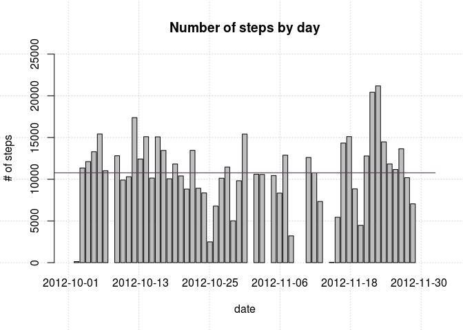
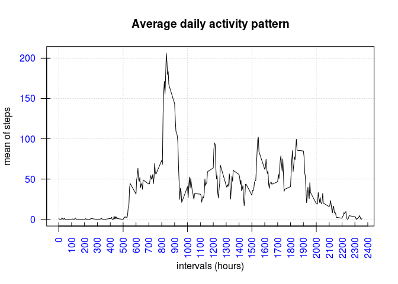
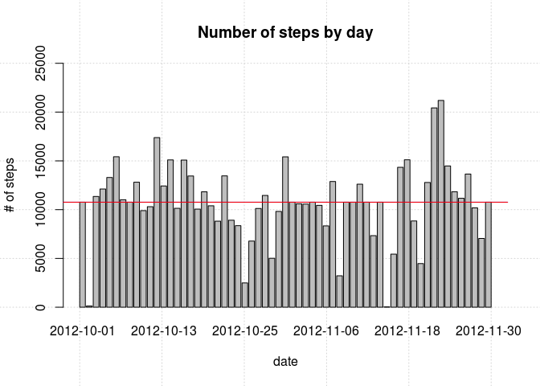
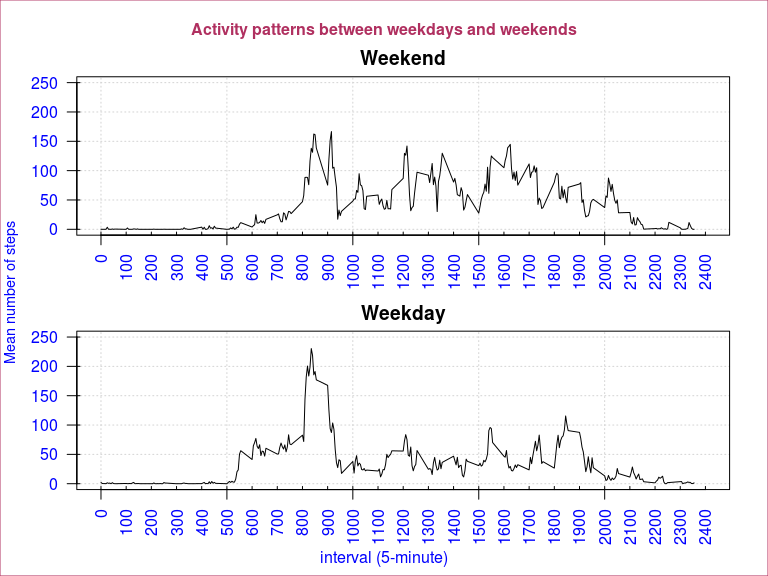

# Reproducible Research: <br>Peer Assessment 1
Sergio Vicente  
February 10th 2015  

You may get source code of this at <https://github.com/svicente99/RepData_PeerAssessment1> 

And html version is available at RPubs: <http://rpubs.com/svicente99/ReprodResearch_Peer_Assesment1>

### Data

The data for this assignment can be downloaded from the course web site:

* Dataset: <a href="https://d396qusza40orc.cloudfront.net/repdata%2Fdata%2Factivity.zip">Activity monitoring data</a> [52K]

The variables included in this dataset are:

* steps: Number of steps taking in a 5-minute interval (missing values are coded as NA)
* date: The date on which the measurement was taken in YYYY-MM-DD format
* interval: Identifier for the 5-minute interval in which measurement was taken

The dataset is stored in a comma-separated-value (CSV) file and there are a total of 17,568 observations in this dataset.

---------

### Loading and preprocessing the data

1. Download from dataset url and save it to local disk

   [out of the scope, here] <br>
   Commands are: 
   
   url <- "http://d396qusza40orc.cloudfront.net/repdata%2Fdata%2Factivity.zip" <br>
   download.file(url, method="internal", destfile="data/activity.zip") <br>
   unzip("data/activity.zip", exdir="data") 
   
2. Read and load .CSV data 


```r
df <- read.csv("data/activity.csv")
head(df)
```

```
##   steps       date interval
## 1    NA 2012-10-01        0
## 2    NA 2012-10-01        5
## 3    NA 2012-10-01       10
## 4    NA 2012-10-01       15
## 5    NA 2012-10-01       20
## 6    NA 2012-10-01       25
```
      
3. Doing some transformations

   (not necessary in this case)

---------

### What is mean total number of steps taken per day?

1. Calculate the total number of steps taken per day


```r
stepsByDay <- aggregate(df$steps, by=list(date=df$date), sum)
head(stepsByDay)
```

```
##         date     x
## 1 2012-10-01    NA
## 2 2012-10-02   126
## 3 2012-10-03 11352
## 4 2012-10-04 12116
## 5 2012-10-05 13294
## 6 2012-10-06 15420
```

2. Calculate mean and median required - the missing values in the dataset will be ignored:


```r
meanTotalStepsByDay <- mean(stepsByDay$x,na.rm=TRUE)
```


```
## [1] "mean = 10766.19"
```


```r
medianTotalStepsByDay <- median(stepsByDay$x,na.rm=TRUE)
```


```
## [1] "median = 10765"
```


3. To illustrate this answer we make a plot (histogram) of steps grouped by day, showing mean (red) and median (blue) lines across all dates.


```r
with(stepsByDay, {    
  barplot(height=x, names.arg=date, xlab="date", ylim=c(0,25000),
    ylab="# of steps", main = "Number of steps by day", panel.first=grid())
})
abline(h=meanTotalStepsByDay, col="blue")
abline(h=medianTotalStepsByDay, col="red")
```

 

---------

### What is the average daily activity pattern?

1. We construct a time series of the average number of steps taken per day, measured
at each 5-minute interval.


```r
stepsByInterval <- aggregate(steps ~ interval, data = df, FUN = mean)
head(stepsByInterval)
```

```
##   interval     steps
## 1        0 1.7169811
## 2        5 0.3396226
## 3       10 0.1320755
## 4       15 0.1509434
## 5       20 0.0754717
## 6       25 2.0943396
```

To illustrate this answer we make a time series plot of data obtained below, grouped by intervals of 5 minutes.


```r
with(stepsByInterval, {
  plot(interval, steps, type="l", xlab="intervals (hours)", ylab="mean of steps", 
       main="Average daily activity pattern", panel.first=grid(), 
       col.axis="white")

# Add minor tick marks
xMarks <- seq(from = 0, to = 2400, by = 100)
yMarks <- seq(from = 0, to = 200, by = 50)
axis(1, at=xMarks, col.axis="blue", las=2, tck=0.02)
axis(2, at=yMarks, col.axis="blue", las=2, tck=0.02)

})
```

 

2. Which 5-minute interval, on average across all the days in the dataset, contains the maximum number of steps?


```r
maxSteps <- stepsByInterval$interval[which.max(stepsByInterval$steps)]
```


```
## [1] "Major number of steps along day = 835"
```

---------

### Imputing missing values

Note that there are a number of days/intervals where there are missing values (coded as 'NA'). The presence of missing days may introduce bias into some calculations or summaries of the data.

1. Calculate the total number of missing values in the dataset (i.e. the total number of rows with NA's)


```r
totMissing <- sum(is.na(df))
```


```
## [1] "Counting of missing values in this database = 2304"
```


2. A strategy for filling in all of the missing values in the dataset could use the mean for that 5-min interval. And that's what we do:


```r
df$steps_2 <- df$steps   # create a new column of steps derivated from 1st one
nObs <- nrow(df)
iRow <- 1
while(iRow <= nObs) {
  if( is.na(df$steps[iRow]) ) {
		intervalRow <- df$interval[iRow]
		df$steps_2[iRow] = stepsByInterval$steps[which(stepsByInterval$interval==intervalRow)]
	}	
	iRow <- iRow+1
}
head(df)
```

```
##   steps       date interval   steps_2
## 1    NA 2012-10-01        0 1.7169811
## 2    NA 2012-10-01        5 0.3396226
## 3    NA 2012-10-01       10 0.1320755
## 4    NA 2012-10-01       15 0.1509434
## 5    NA 2012-10-01       20 0.0754717
## 6    NA 2012-10-01       25 2.0943396
```

3. Making a histogram of the total number of steps taken each day and calculating and reporting the mean and median total number of steps taken per day. 


```r
stepsByDay <- aggregate(df$steps_2, by=list(date=df$date), sum)
meanTotalStepsByDay <- mean(stepsByDay$x)
medianTotalStepsByDay <- median(stepsByDay$x)
```


```r
with(stepsByDay, {    
  barplot(height=x, names.arg=date, xlab="date", ylim=c(0,25000),
    ylab="# of steps", main = "Number of steps by day", panel.first=grid())
})
abline(h=meanTotalStepsByDay, col="blue")
abline(h=medianTotalStepsByDay, col="red")
```

 


```
## [1] "(new) mean = 10766.19"
```

```
## [1] "(new) median = 10766.19"
```

Do these values differ from the estimates from the first part of the assignment? 

==> _As we can see, only median has different value (it was 10765)._

What is the impact of imputing missing data on the estimates of the total daily number of steps?

==> _**Very low**. Because we replaced all 'NA's by mean, median value just turned out the same value of mean._


---------

### Are there differences in activity patterns between weekdays and weekends?

This part uses the <a target="_blank" href="http://127.0.0.1:26327/library/base/html/as.POSIXlt.html">"POSIXlt()"</a> function. We also use the dataset with the filled-in missing values just set before.

1. Create a new factor variable in the dataset with two levels - "weekday" and "weekend" indicating whether a given date is a weekday or weekend day.

To do this let's create first a function to point out what day belongs to weekday or not.


```r
vTpDays <- c("Weekend", "Weekday")

week_period <- function(v_date) {
  d <- as.POSIXlt(as.Date(v_date))$wday
  return( ifelse(d == 0 || d == 6, vTpDays[1], vTpDays[2]) )
}
```

And then, we create a new column named 'tpDay' and apply this function to evaluate its value


```r
df$tpDay <- as.factor( sapply(df$date, week_period) )
head(df)
```

```
##   steps       date interval   steps_2   tpDay
## 1    NA 2012-10-01        0 1.7169811 Weekday
## 2    NA 2012-10-01        5 0.3396226 Weekday
## 3    NA 2012-10-01       10 0.1320755 Weekday
## 4    NA 2012-10-01       15 0.1509434 Weekday
## 5    NA 2012-10-01       20 0.0754717 Weekday
## 6    NA 2012-10-01       25 2.0943396 Weekday
```


2. Make a panel plot containing a time series plot of the 5-minute interval (x-axis) and the average number of steps taken, averaged across all weekday days or weekend days (y-axis). 


```r
## create a panel layout 2x1 and establish margin values
par(mfrow=c(2, 1), mar=c(3, 3, 2, 1), oma=c(1.5, 1, 2, 1)) 

## plot both line graphs side by side showing differences
for( td in vTpDays ) {
    stepsByTpDay <- aggregate(steps_2 ~ interval, data = df, subset = (df$tpDay == td), FUN = mean)
    plot(stepsByTpDay, type = "l", main = td, xlab="", ylab="", ylim=c(0,250), xlim=c(0,2400), 
    panel.first=grid(), col.axis='white')

    xMarks <- seq(from = 0, to = 2400, by = 100)
    axis(1, at=xMarks, col.axis="blue", las=2, tck=0.02)
    yMarks <- seq(from = 0, to = 250, by = 50)
    axis(2, at=yMarks, col.axis="blue", las=2, tck=0.02)
}
mtext( "interval (5-minute)", side=1, outer=TRUE, col="blue", font=1 )  
mtext( "Mean number of steps", side=2, outer=TRUE, col="blue", font=1, cex=0.9 )  
mtext( "Activity patterns between weekdays and weekends", side=3, outer=TRUE, col="maroon", font=2 )  
box("outer", col="maroon") 
```

 

